# <h1 align="center"> Senior-architect-PMP</h1>

本仓库主要介绍PMP项目管理仓库，帮助大家对学习和了解项目管理，同时学习项目管理的基本原理和项目管理的工具。
同时结合自身的项目经验，帮助大家能够在工作经验和工作升级上提供一定的帮助。

---
> 其他平台将同步更新
> - [Github] https://github.com/2462612540
> - [Gitee] https://gitee.com/xjl2462612540
> - [CSDN] https://blog.csdn.net/weixin_41605937?spm=1001.2014.3001.5343
> - [雀语] https://www.yuque.com/zhuangxiaoyan/kgkvky/igxzid
---
# 一、Xmind

- [PMP项目管理视频教程百度云] https://pan.baidu.com/s/1XT5Eawg129UxGl9RxmXWQA 提取码：bmrh

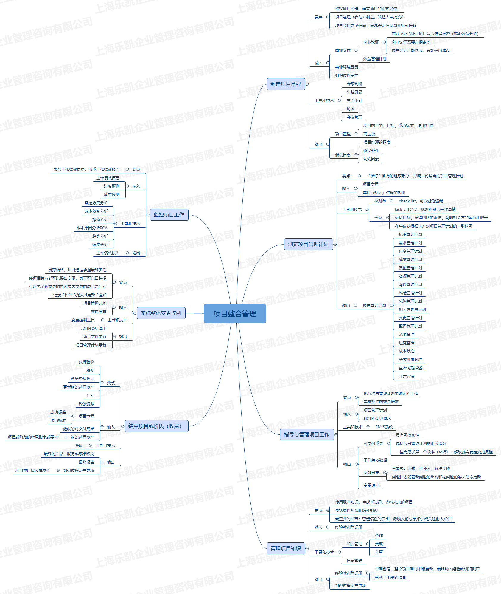 
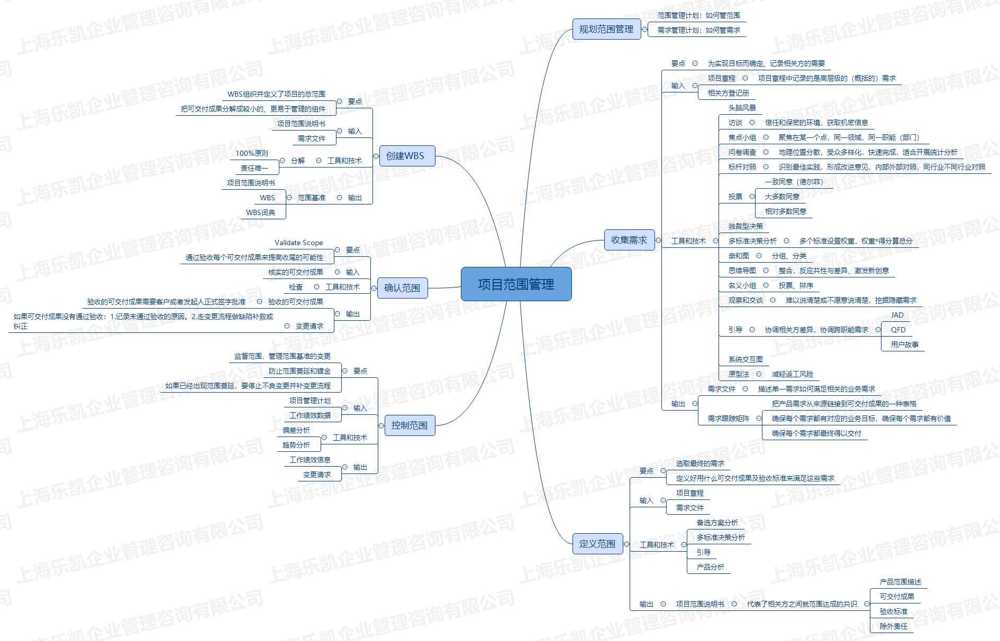 
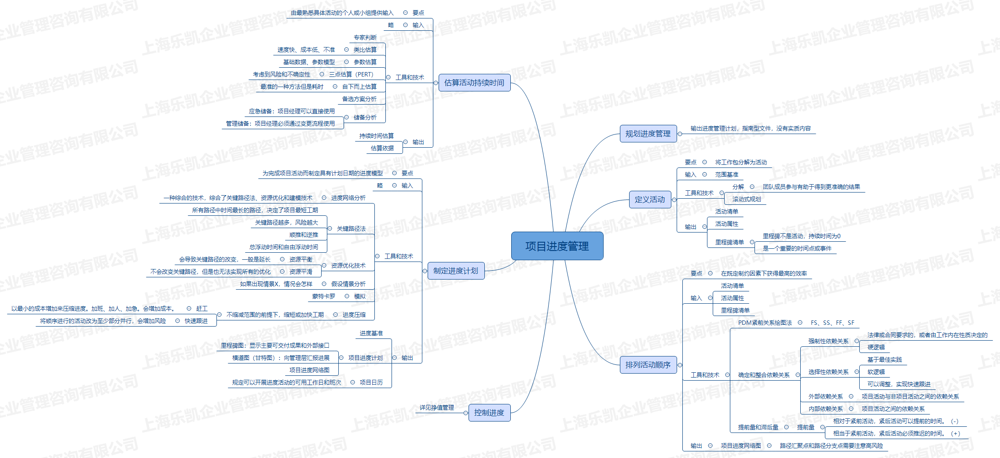 
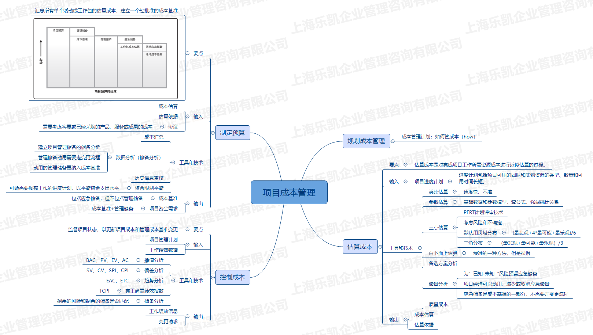 
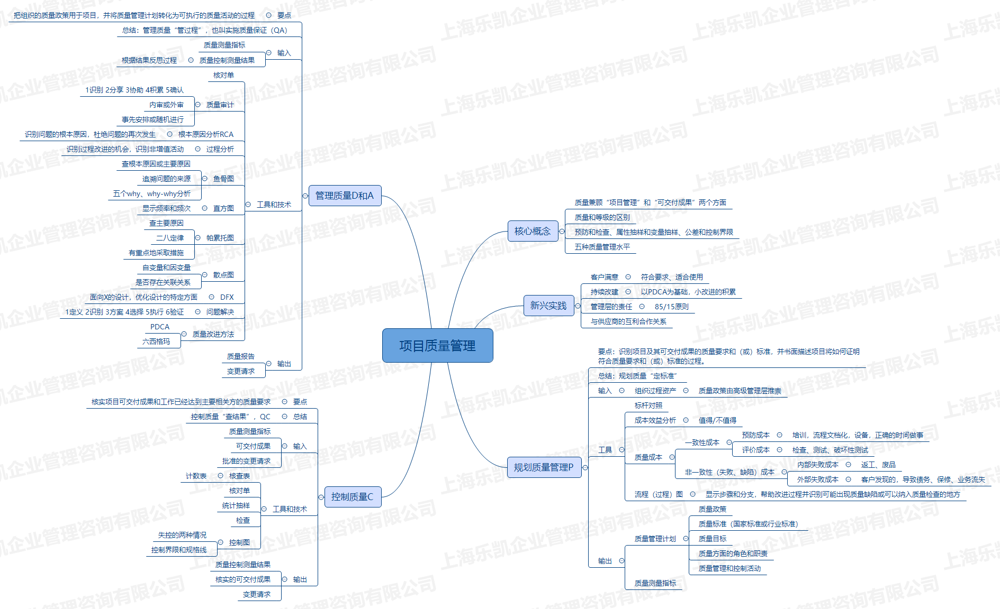 
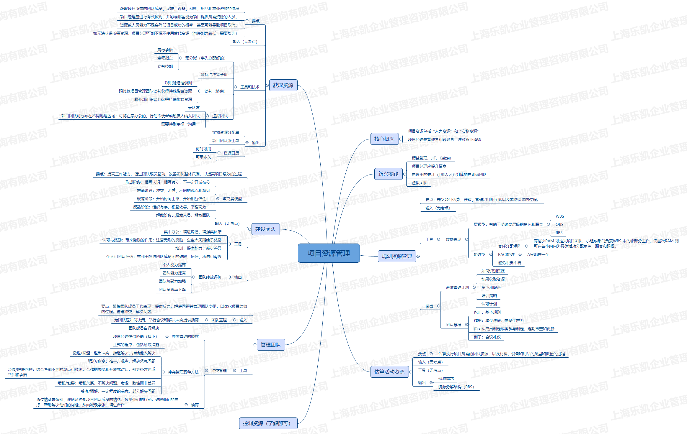 
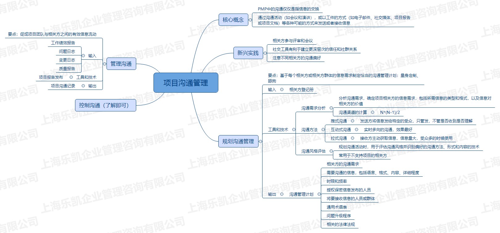 
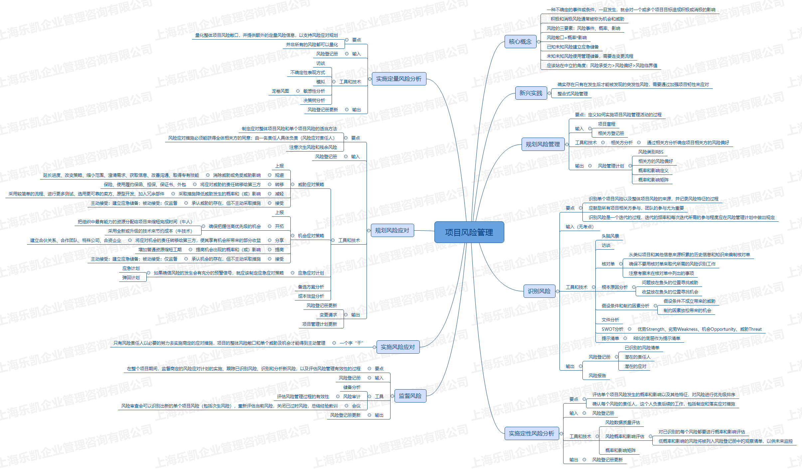 
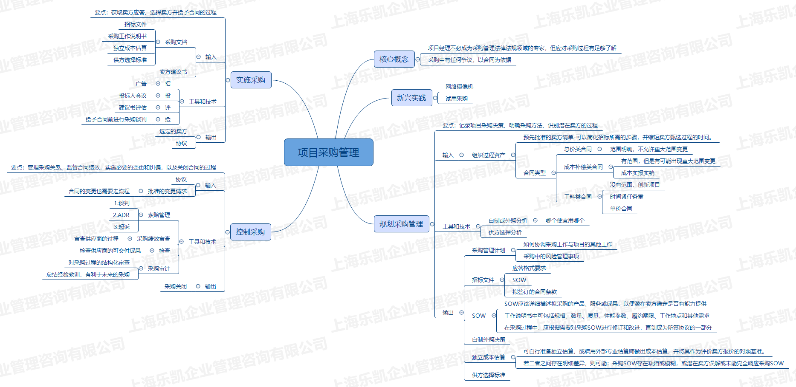 
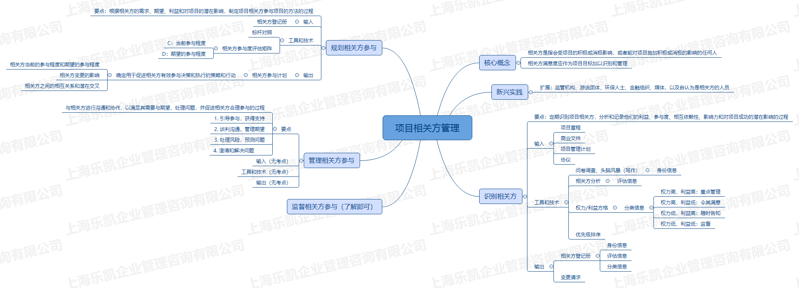 
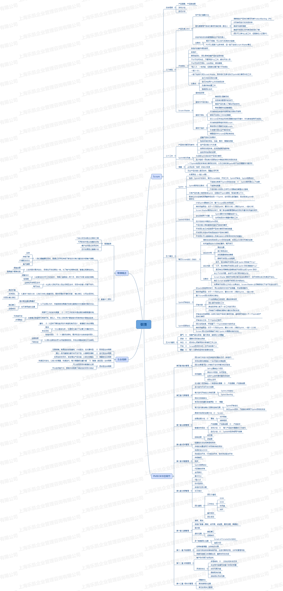 

---

# 二、PMP培训讲义
- PMP项目管理培训讲义.pdf

---
# 三、PMP章节知识点
- 01~03 第一~三章.pdf
- 04第四章.pdf
- 05第五章.pdf
- 06第六章.pdf
- 07第七章.pdf
- 08第八章.pdf
- 09第九章.pdf
- 10第十章.pdf
- 11第十一章.pdf
- 12第十二章.pdf
- 13第十三章.pdf
---

# 四、PMP章节练习
- 每日一练-第1-3章.pdf
- 每日一练-第4章.pdf
- 每日一练-第5章.pdf
- 每日一练-第6章.pdf
- 每日一练-第7章.pdf
- 每日一练-第8章.pdf
- 每日一练-第9、10、13章.pdf
- 每日一练-第11章.pdf
- 每日一练-第12章+综合一.pdf
- 每日一练-综合二.pdf
- 每日一练-综合三.pdf
- 每日一练-综合四.pdf
---
# 五、PMP项目管理实战讲解相关模板
- 00售前交接单.docx
- 01项目立项书（项目章程）.docx
- 02周报.doc
- 03项目状态报告（工作绩效报告）.docx
- 04会议纪要.doc
- 05会议签到表.doc
- 06工程变更申请表（范围变更）.doc
- 07工程延期报审表（进度变更）.doc
- 08工程变更费用申请报表（成本变更）.doc
- 09项目验收报告.doc
- 10用户需求说明书（需求）.doc
- 11系统功能说明书（范围）.doc
- 12质量审计核对单示例.xlsx
- 13项目质量报告示例.doc
- 14风险管理计划.docx
- 15风险处置记录.xlsx
- 16残余风险评价报告.docx
---
# 六、项目管理实用表格与应用
- 规划.doc
- 启动.doc
- 执行.doc
- 收尾.doc
- 监督和控制.doc
---

# 七、项目管理工具方法-爱立信
- 0-问题解决工具矩阵图.xls
- 1-1亲和图new.doc
- 1-脑力激荡法new.doc
- 2-鱼骨图（因果图）new.doc
- 3-结构树分析new.doc
- 4-帕累托分析new.doc
- 5-1.利弊均衡表new.doc
- 5-方案决策标准评估表new.doc
- 6-流程图.doc
- 7-甘特图new.doc
- 8-1.标准评估new.doc
- 8-2.绝对标准评估new.doc
- 9.风险评估new.doc
---

# 八、项目管理思维导图
- (人力) 项目组成员访谈表.pdf
- (全局) 项目主视图.pdf
- (全局) 项目会议.pdf
- (基础) 项目定义.pdf
- (控制) 项目报告.pdf
- (控制) 项目状态报告.pdf
- (控制) 项目状态报告列表.pdf
- (结项) 培训.pdf
- (结项) 项目评审.pdf
- (计划) 工作分类结构（WBS）.pdf
- (计划) 项目干系人满意定义.pdf
- (计划) 项目沟通路径.pdf
- (计划) 项目组成员.pdf
- (计划) 项目组成员列表.pdf
- (计划) 项目计划包含阶段.pdf
- (计划) 项目资源.pdf
- (计划) 项目风险评估.pdf
- 90天角色转换.pdf
- 软件公司技术管理.pdf
- 软件需求分析工作.pdf
- 项目审核检查单.pdf
- 项目工作交流.pdf

---

# 九、项目管理模板
- 模板.XLS
- 项目需求建议书（RFP）.doc

---
# 十、项目管理模板集
- WBS模板.doc
- 初步的预算估计.doc
- 绩效报告.doc
- 项目变更请求.doc
- 项目启动会议.doc
- 项目启动会议议程.doc
- 项目团队培训计划.doc
- 项目干系人登记册.doc
- 项目总结.doc
- 项目沟通计划.doc
- 项目状况报告.doc
- 项目章程.doc
- 项目结束报告.doc
- 项目范围描述.doc
- 项目评价和选择.doc
- 项目质量管理计划.doc
- 项目进度管理计划.doc
- 项目预算.doc
- 项目风险管理工作表.doc
- 项目验收审批表格.doc
---
# 十一、IT项目管理表格
- 第1部分：IT项目启动阶段
- 第2部分：IT项目计划阶段
- 第3部分：IT项目执行控制阶段
- 第4部分：IT项目收尾阶段
---
# 仓库说明
> 本项目所有内容来源于个人总结而形成。同时大部分内容是学习互联网上的相关知识和翻阅相关书籍原著获得，所以在一些知识的理解上可能存在错误，肯请各位大佬及时指出。
> 另外项目中部分图像是直接引用而来，如果涉及到相关的版权问题，请及时联系我我的邮箱是：18279148786@163.com 本人将立即改正。